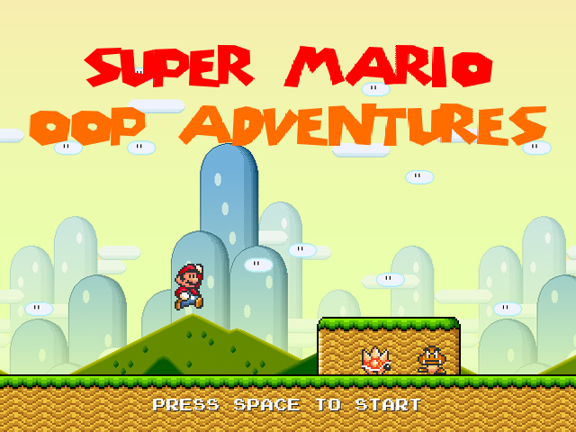

Super Mario: OO Adventures
==========================

It's me, Mario!

Credits:
* Mario series: Nintendo
* Graphics: Nintendo, Tech Static/Bowserman, Guss, Black Squirrel, http://www.mariouniverse.com/




Building
--------

```
$ apt-get install liballegro5-dev
$ git clone github.com:mg6/Mario && cd Mario
$ make
$ cd bin && ./Mario
```

Documentation
-------------

You can generate the documentation with `make doc`. See `doc` directory afterwards.
Make sure Graphviz is installed for diagrams.
